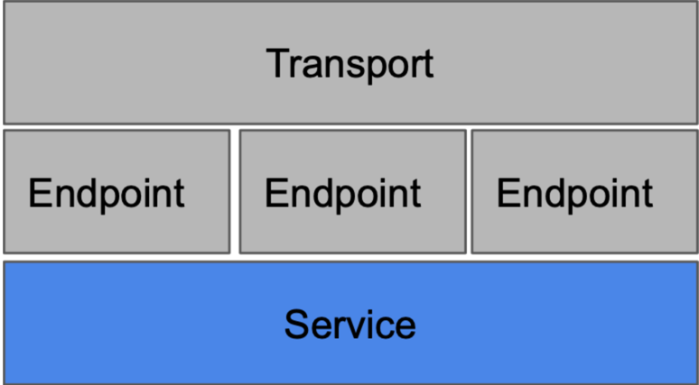

# gokit-useraccount
go-kit microservice example to create and fetch the user details

# Go kit Architecture

There are three major components in the Go kit based application architecture:

    Transport layer :- The transport domain is bound to concrete transports like HTTP or gRPC. In a world where microservices may support one 
                       or more transports, it can support a legacy HTTP API and a newer RPC service, all in a single microservice.
    
    Endpoint layer :- An endpoint is like an action/handler on a controller; it’s where safety and antifragile logic lives. 
                      If you implement two transports (HTTP and gRPC), you might have two methods of sending requests to the same endpoint.
    
    Service layer :- Services are where all of the business logic is implemented. In Go kit, services are typically modeled 
                     as interfaces,and implementations of those interfaces contain the business logic.

# gokit-useraccount microservice calling flow

i).   main.go
ii).  server.go
iii). endpoints.go
iv).  service.go (implementation is logic.go)
v).   repository.go